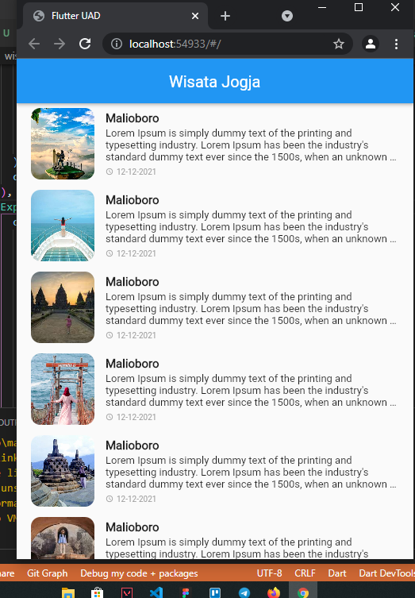
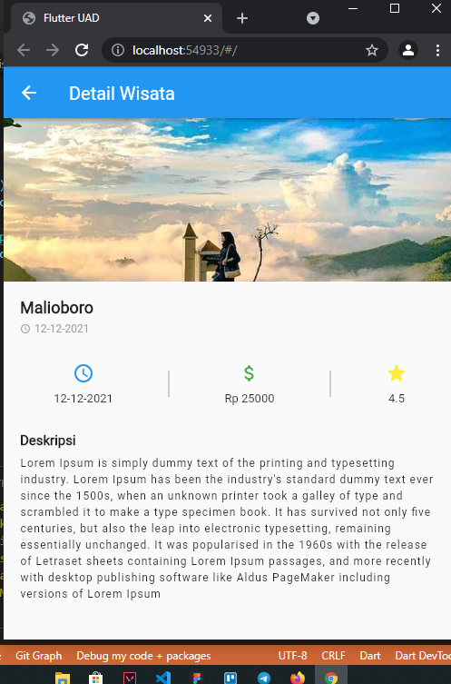

# Latihan 4

Pada latihan 4 ini merupakan contoh studi kasus untuk menampilkan list wisata yang ada di Jogja 
Disini menggunakan model untuk me list wisata" yang ada di jogja, lalu ditampung dalam sebuah list. Lihat pada file `wisata_model.dart`. 
Selanjutnya disini kita coba memisahkan widget yang kita costumize sendiri terpisah dengan file tampilan aslinya. Contoh => File tampilan UI nya adalah `wisata_page.dart` dan untuk costumize widgetnya berada pada file `wisata_page_widget.dart`. 
Untuk bisa melacak file/ widget yang digunakan, kalian bisa menahan tombol `ctrl` lalu arahkan pointer ke `widget` yang ingin di telusuri setelah itu klik. Otomatis kalian akan diarahkan dimana costumize widget itu berada. 
Berikut beberapa Screenshot tampilan :   
   

